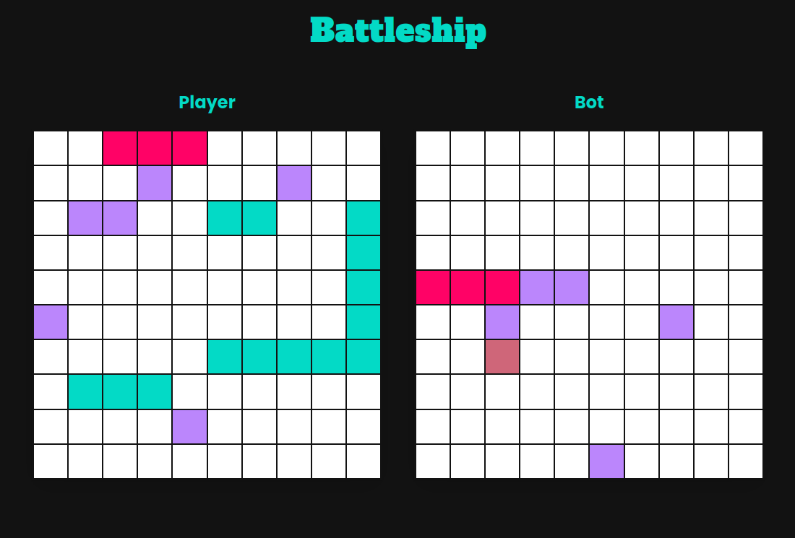

# Battleship

A battleship game built using TDD & OOP principles. Testing via Vitest, packaged via Vite & NPM.

[Demo here](https://cassbattleship.netlify.app/)

## Tech Used
* Vanilla JS, HTML & SCSS (SASS)
* Vitest (for unit testing)
* NPM & Vite
* Sanitize CSS (for reset)

## Features
* A (somewhat) smart AI that uses a queue to find logical moves
* A recursive filter for placing ships (and creating random ships)
* Responsive on PC, Tablet & Mobile
* Dark-mode, high-contrast styling

## Thoughts
I found taking a TDD approach extremely useful when building the basic game loop and class constructors. I'd read a lot about building features incrementally (while testing each addition). This was slower (and a little frustrating) at first, but after the game logic became more complex and intertwined I found I could really see it's value. With unit testing it feels like you're 'locking in' each feature. Slower at first but faster the more complex the program becomes! I also decided to use Class/constructor functions over factories for my module structuring. The course that I'm following seems to argue for composition over inheritance (which I certainly see the logic) but I do find classes look very neat and readable. 

## Possible Improvements
* There are a few edge cases where the AI will default to throwing out random moves even while there are coordinates in the queue. I may come back and add extra depth to the validation checking. This only affects situations where multiple ships are positioned next to each other.
* I'm not 100% happy with the way the background blur contrasts with some of the modal text. I haven't found a preferred option yet so have left it as is (it looks OK)
* The time complexity of my filter/AI logic depends on lots of loops. There are a few areas I could probably improve this by adding hash maps or stacks to enable returning from the loops early
* Although I've tried to separate everything into logical ES6 modules there are areas I think I could de-couple them more. I've tried to repeat code as little as possible (I've passed a fair bit of the code used for filtering between modules). I think this is more efficient but does make my code more confusing to read. My aim is always to try to make my code as easy to understand as possible so I'll be extra conscious of this in future.

## Credits
* Fluid CSS scaling defaults from [fluid-type-scale.com](https://www.fluid-type-scale.com/)
* Project idea from [The Odin Project](https://www.theodinproject.com/lessons/node-path-javascript-battleship)